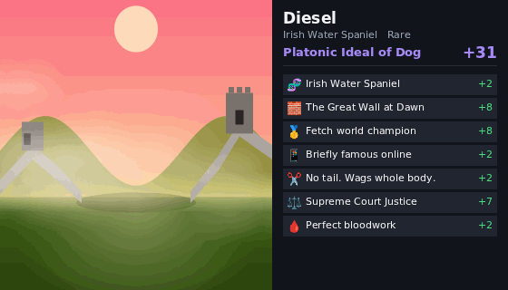
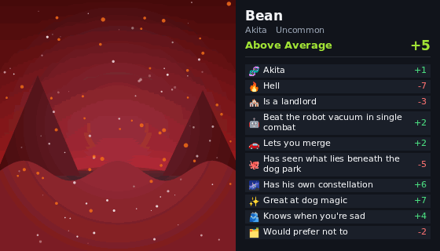
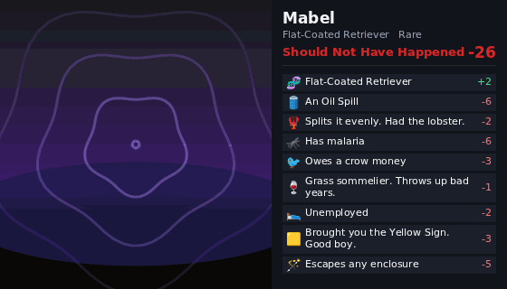

# Dogdle

**One dog. Once a day. No rerolls.**

Play it at **[dogdle.swampkat.com](https://dogdle.swampkat.com)**.

Dogdle is a daily dog slot machine. Pull the lever and you're dealt a dog for the day: a
real breed with a real photo, a name, a place it happens to be standing, and a handful of
traits that are each an asset or a liability. The traits add up to a score, the score
lands your dog in one of nine tiers, and everyone who played that day ends up on the same
leaderboard.

Whatever you get, you keep. Tomorrow there's a new dog.

---

## How a day works

1. **Pull the lever.** Your dog for the day appears: photo, name, breed, where it's
   standing, and its traits, each with an emoji and a point value.
2. **That's your dog.** Refreshing won't change it. The same player on the same day always
   gets the same dog, and it's stored the moment it's dealt.
3. **See how you did.** The **Today** tab shows everyone's dogs for the day, best first.
   **My dogdles** lists every dog you've had.
4. **Share it.** **Copy share card** copies a short summary plus a link to an animated GIF
   of your dog, which pastes into Discord as the image itself.
5. **Come back tomorrow.** The day rolls over at midnight US Eastern.

You can also play from Discord (see [the Discord bot](#the-discord-bot)). Link your web
account to Discord and both places deal you the **same dog** each day.

---

## What makes a dog

Every dog is built from four parts. Each one is worth points, and the points add up to
its **score**.

| Part | What it is | Points |
|---|---|---|
| 🧬 **Breed** | About 130 real breeds, each with a real photo from the [Dog CEO API](https://dog.ceo/dog-api/). Rarity follows the real world: Labradors are Common, Otterhounds are Legendary. | Common 0 · Uncommon +1 · Rare +2 · Epic +4 · Legendary +6 |
| 🗺️ **Place** | Where your dog is standing: around a hundred scenes, from The Couch and A Sidewalk to Hell, the Northern Lights and the Heat Death of the Universe. Each is an animated backdrop with its own weather and light. | −10 (the Heat Death of the Universe) to +12 (Heaven) |
| ✨ **Traits** | Four to eight of them, drawn from hundreds. Some are lovely (*Knows when you're sad*), some are not (*Rolls in dead things*), and some are just odd (*Owes a crow money*). Many come with a visual effect: a halo, fog, a glitch, something falling from the sky. | Mostly −5 to +4, with rare bigger swings |
| 🏷️ **Name** | Picked from a big pool of dog names. | Just for fun |

A few traits can't be stacked: a dog has one build, one job, one voice, so it will never
be both *Starved* and *Thick boy*.

Breed rarity is kept small on purpose. A Legendary breed is a nice start, not a win: six
traits easily outweigh six points, so a Common pug can be a Platonic Ideal and a Legendary
Dhole can be a disaster.

### Tiers

The score decides the tier. Everything is balanced so **the average dog scores 0**, and
most days land somewhere in the middle three.

| Tier | Score |
|---|---|
| 👑 Platonic Ideal of Dog | +25 and up |
| 🌟 Exceptional Animal | +16 to +24 |
| 🦴 Good Dog | +9 to +15 |
| 🙂 Above Average | +3 to +8 |
| 😐 Perfectly Average | −2 to +2 |
| 🙃 Below Average | −8 to −3 |
| 😬 Rough | −15 to −9 |
| 🚨 Genuinely Concerning | −24 to −16 |
| 💀 Should Not Have Happened | −25 and below |

Each end of the ladder turns up for roughly one dog in 300.

---

## Some real dogs

These came straight out of the generator (`rollDailyDog` in `src/roll.js`), dealt for a
few test players on 2026-09-30, exactly as it rolled them when this was written.

The cards are the Discord share cards, rendered offline with `npm run card`. There's no
network there, so the photo slot in the middle is empty; on the live site and in Discord,
the dog's real photo stands in that spot.

### 👑 Diesel the Irish Water Spaniel · Platonic Ideal of Dog · +31



| | | |
|---|---|--:|
| 🧬 | Irish Water Spaniel (Rare) | +2 |
| 🧱 | The Great Wall at Dawn | +8 |
| 🥇 | Fetch world champion | +8 |
| 📱 | Briefly famous online | +2 |
| ✂️ | No tail. Wags whole body. | +2 |
| ⚖️ | Supreme Court Justice | +7 |
| 🩸 | Perfect bloodwork | +2 |

### 🙂 Bean the Akita · Above Average · +5

Stuck in Hell, but great at dog magic.



| | | |
|---|---|--:|
| 🧬 | Akita (Uncommon) | +1 |
| 🔥 | Hell | −7 |
| 🏘️ | Is a landlord | −3 |
| 🤖 | Beat the robot vacuum in single combat | +2 |
| 🚗 | Lets you merge | +2 |
| 🐙 | Has seen what lies beneath the dog park | −5 |
| 🌌 | Has his own constellation | +6 |
| ✨ | Great at dog magic | +7 |
| 🫂 | Knows when you're sad | +4 |
| 🗂️ | Would prefer not to | −2 |

### 💀 Mabel the Flat-Coated Retriever · Should Not Have Happened · −26



| | | |
|---|---|--:|
| 🧬 | Flat-Coated Retriever (Rare) | +2 |
| 🛢️ | An Oil Spill | −6 |
| 🦞 | Splits it evenly. Had the lobster. | −2 |
| 🦟 | Has malaria | −6 |
| 🐦 | Owes a crow money | −3 |
| 🍷 | Grass sommelier. Throws up bad years. | −1 |
| 🛌 | Unemployed | −2 |
| 🟨 | Brought you the Yellow Sign. Good boy. | −3 |
| 🪄 | Escapes any enclosure | −5 |

### A few more from the same day

**🌟 Denise the Scottish Terrier · Exceptional Animal · +21**

| | | |
|---|---|--:|
| 🧬 | Scottish Terrier (Uncommon) | +1 |
| ❄️ | A Snowy Field | +2 |
| 🗑️ | Brings the neighbors' trash cans in | +2 |
| 🧠 | Alarmingly clever | +4 |
| 🌤️ | Unbothered by anything the sky does | +3 |
| 📞 | Butt-dialled 911 | −3 |
| 🥇 | Fetch world champion | +8 |
| 📝 | Ate the homework. Did it first. | +2 |
| 🕊️ | Forgave you for something you forgot | +2 |

**😐 Carol the Brussels Griffon · Perfectly Average · 0**

| | | |
|---|---|--:|
| 🧬 | Brussels Griffon (Rare) | +2 |
| 🛏️ | Under the Bed | 0 |
| 📹 | Says I love you, but only on camera | +1 |
| 💥 | Tail clears coffee tables | −2 |
| 🚪 | Has learned to open doors | −1 |
| 🌊 | Missed the Ark. Swam. | +2 |
| 🎩 | Not the same since the magician | −2 |

**🚨 Rueben the Shih Tzu · Genuinely Concerning · −17**

| | | |
|---|---|--:|
| 🧬 | Shih Tzu (Common) | 0 |
| 🚶 | A Sidewalk | −1 |
| 🎐 | Wind chimes go quiet when he enters | −3 |
| 🥩 | Steals food off the counter | −4 |
| 🦨 | Rolls in dead things | −5 |
| 🌒 | Slept through every eclipse | 0 |
| ✏️ | Named after the owner's ex | −1 |
| 🔦 | Came back from camping alone | −3 |

---

## Your kennel

Every dog you roll goes into your **kennel**, a public album of your collection:

- how many **breeds**, **places**, **traits** and **tiers** you've found, out of
  everything there is to find
- **the year so far**: one square per day, coloured by how good that day's dog was
  (click a day to jump to its dog)
- your **best dog**, **worst dog**, **average dog** and **rarest find**
- a map of every place in the game, lit up where your dogs have been
- **every dog** you've rolled, with its card, sortable by newest, best or worst

Kennels live at `/kennel/<username>` for web accounts (the account bar has a **My
kennel** link) and `/kennel/discord-<id>` for Discord players. Paste a kennel link into
Discord and it unfurls with the album image.

## The Mega-Kennel

**[/kennels](https://dogdle.swampkat.com/kennels)** is every dog anyone has ever rolled,
web and Discord together: the best and worst dogs ever, the all-time average dog, the
most rolled breed, every player's kennel, and a searchable wall of every dog.

---

## Accounts

Every dog belongs to someone with a name, so the first time you visit, Dogdle asks
who's rolling:

- **Pick a username and an emoji PIN.** The PIN is 3 to 6 taps on a 3×3 pad of emoji.
  Your username is public (it's on the leaderboard and in your kennel's address).
- **Sign in anywhere.** Your username and PIN bring your dogs, and today's dog, to
  another browser or device. Five wrong PINs lock the username for 15 minutes.
- **Sync with Discord.** The **🔗 Sync with Discord** button in the account bar gives you
  a code. Send `/dogdle link <code>` in any server with the Dogdle bot within ten
  minutes, and your website and Discord dogs become one kennel. From then on both deal you
  the same dog each day.

There's no self-serve PIN reset, so keep your PIN somewhere safe.

---

## The Discord bot

Dogdle has a Discord bot. The bot itself lives outside this repo: it talks to this
Worker's bot API (`/api/bot/*`), and [`docs/discord-bot-prompt.md`](docs/discord-bot-prompt.md)
is the spec it's built from. It gives you:

- **`/dogdle`**: roll today's dog and post its card
- **a daily digest**: everyone's dogs from yesterday in one post, Wordle-bot style
- **`/dogdle kennel`**: your collection as one image
- **`/dogdle best`**: your best dogs and your worst
- **`/dogdle day <date>`**: the dog you got on a given day
- **`/dogdle link <code>`**: connect your website account

A Discord player is their own player, so rolling in Discord doesn't use up an unlinked
web account's roll (and vice versa). Everyone lands on the same global leaderboard, and
each server also gets a board of just its own people.

---

## Run it yourself

Dogdle is one [Cloudflare Worker](https://developers.cloudflare.com/workers/) with a KV
store. The generator, the web game, the kennels and the Discord card renderer are all
plain JavaScript with no framework.

```bash
npm install
npm test          # the whole test suite, about five seconds, no extra dependencies
npm run dev       # the game at http://localhost:8787, with a local KV store
```

While `npm run dev` is running, **`/dev`** gives you unlimited rerolls for playtesting,
and **`/reset`** gives your browser a fresh player.

Handy previews, all offline. They write files into the current directory, and are
gitignored:

```bash
npm run card -- alice,bob 2026-09-22     # Discord cards for those players on that day -> card-<player>.gif
npm run kennel -- alice 40               # a 40-day kennel album -> kennel-alice.gif
npm run sheet -- out.png beach,volcano   # a contact sheet of places (leave the keys off for all of them)
npm run balance                          # where the average dog sits, and the spread across tiers
```

### Where things live

| Where | What |
|---|---|
| `src/roll.js` | The generator: seeds a random number generator from `player:date` and deals the dog |
| `src/breeds.js` | Breeds, their photo lookups and rarity |
| `src/content/` | Traits, places, names and tiers |
| `src/worker.js` | The web routes; `src/bot.js` is the Discord bot API |
| `src/kennel.js`, `src/mega.js` | Kennels and the Mega-Kennel |
| `src/accounts.js` | Usernames, emoji PINs and Discord linking |
| `src/card.js` | Draws share cards as GIFs inside the Worker |
| `public/` | The web game, kennel pages, and `effects.js`, the animation engine the page and the cards share |
| `test/` | The test suite |

### Going deeper

- **[`docs/how-it-works.md`](docs/how-it-works.md)**: the *why*. How the content is
  balanced, the storage layout, how cards are drawn without a canvas, the bot API, test
  rolls, deploys and the ops workflows, plus the content counts.
- **[`CLAUDE.md`](CLAUDE.md)**: the rules for changing things without breaking them.
  Read it before touching content (never delete a trait, keep the average dog at 0).
- **[`docs/discord-bot-prompt.md`](docs/discord-bot-prompt.md)**: the bot's API and build
  spec.

Every push to the default branch runs the tests and deploys to production, so work on
a branch and open a pull request.

---

## Credits

Dog photos from the [Dog CEO API](https://dog.ceo/dog-api/). GIF encoding by
[gifenc](https://github.com/mattdesl/gifenc). Full credits are in
[`docs/how-it-works.md`](docs/how-it-works.md#credits).
